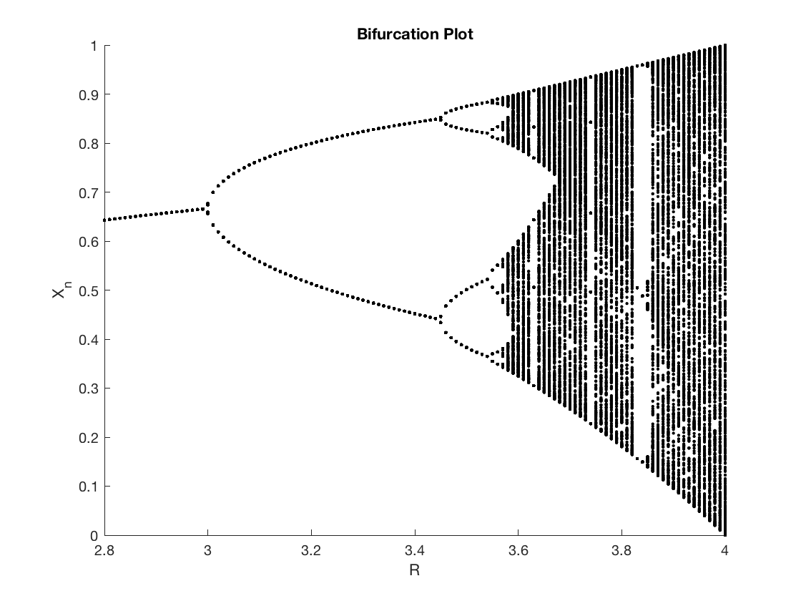
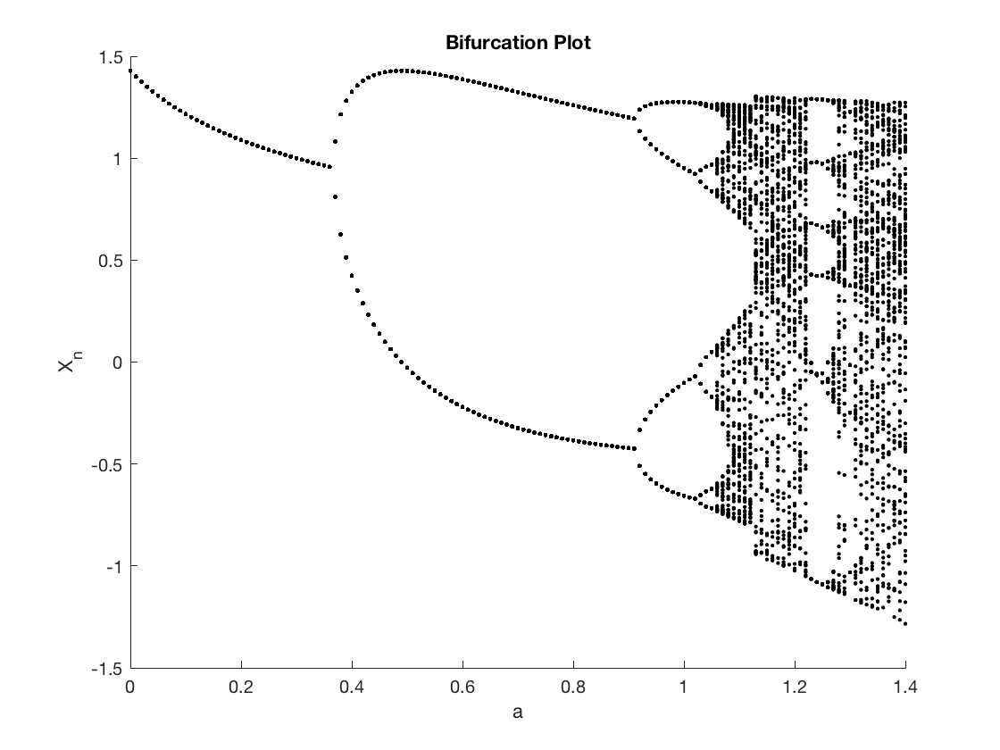

## Chaotic Dynamics - Bifurcation Plots of Logistics & Henon Maps

## Bifurcation Plot of Logistics Map:
First, a bifurcation plot of the logistic map, $x_{n+1} = R x_n(1-x_n)$ was created to show the effect of the parameter R on the dynamics of the system. For each value of R, 1000 iterations were taken with the first 500 removed to get rid of the transient blurring effect with out removing too many points in order to see the chaotic behavior at higher R values. The R values were taken over the range 2.8 - 4, with a step size of 0.01. While higher step size gives better results, the program's computation time was taken into account. The results are shown in figure 1, below:

|        |
|:------------------------------------------------:|
| Bifurcation plot ( $R_{step} = 0.01$ )           |
 

## Feigenbaum Number
In order to calculate the Feigenbaum number experimentally, the limit: $\delta = \lim_{k\to\infty} \frac{b_k - b_{k-1}}{b_{k+1} - b_{k}}$ was taken over a finite set of R values at each bifurcation, $b_k$. The higher the cycles get as the system continues to have bifurcations the more accurate the estimate of the Feigenbaum number becomes. For the sake of this problem set, the first 4 bifurcations and the corresponding R values ($b_1 - b_4$) in the bifurcation tree will be used to estimate the Feigenbaum number. These R values are tabulated below:

| **$b_k$** | **R**     |
|:---------:|:---------:|
| $b_1$     | 3         |              
| $b_2$     | 3.4493    |
| $b_3$     | 3.5440    |
| $b_4$     | 3.5644    |      
 

Using the relation described above to calculate the Feigenbaum number over the discrete R values tabulated above, gave the following results: 

$$
    \delta_1 = \frac{b_2 - b_{1}}{b_{3} - b_{2}} = 4.744
$$

$$
    \delta_2 = \frac{b_3 - b_{2}}{b_{4} - b_{3}} = 4.6422
$$

Comparing these values with the known value of the Feigenbaum number for 1-D systems, 4.6692016, shows that the experimental results were reasonable and that $\delta$ became more accurate as values of R deeper in the bifurcation tree were used.

## Henon Map
Repeating the same process from above for a Henon Map, given by the relation: 

$$
    x_{n+1} = y_n + 1  - a x_n^2, \qquad y_{n+1} = b x_n
$$
 

Plotting the bifurcation plot for the Henon map with $b = 0.3$, and the value of $a$ ranging from 0 to 1.4 with a step size of 0.01, gives the following results (Note: either $x_n$ or $y_n$ could be used on the dependent axis of the plot):  

|      |
|:------------------------------------------------:|
| Bifurcation plot ( $a_{step} = 0.01$ )           |
 

Similar to problem 2, the limit $\delta = \lim_{k\to\infty} \frac{b_k - b_{k-1}}{b_{k+1} - b_{k}}$ was taken with over a finite set of just the first 4 $b_k$ values, which will correspond to the values of the parameter $a$ at which the bifurcations occurred. These values of $a$ are tabulated below and their corresponding $\delta$ values.  

| **$b_k$** | **a** |
|:---------:|:------:|
| $b_1$     | 0.3667 |  
| $b_2$     | 0.9121 | 
| $b_3$     | 1.0257 |
| $b_4$     | 1.0511 |  
 

$$
    \delta_1 = \frac{b_2 - b_{1}}{b_{3} - b_{2}} = 4.8011, \qquad  \delta_2 = \frac{b_3 - b_{2}}{b_{4} - b_{3}} = 4.4724
$$
 

## Henon Map vs. Logisitics Map
When comparing the delta values calculated from the Henon Map to that of the Logistic Map, it is noticed that they are relatively similar. While the Logistic Map is supposed to have values of $\frac{b_k - b_{k-1}}{b_{k+1} - b_{k}}$ that remain at fixed value equal to the Feigenbaum number, the Henon Map does not necessarily need to satisfy this condition. The Logistic Map is a 1-D non-linear map, which mean that the $\delta$ values will always be equal to the  Feigenbaum number. The Henon Map is a 2-D non-linear map, which means that the ratio $\frac{b_k - b_{k-1}}{b_{k+1} - b_{k}}$ does not need to equal the Feigenbaum number. In this case, the Henon Map had values of $\delta$ that were interestingly very close, but this does not need to be true.